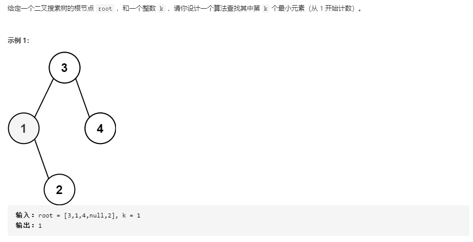

## 二叉搜索树中第K小的元素

### 题目链接

[LeetCode: 230. 二叉搜索树中第K小的元素](https://leetcode-cn.com/problems/kth-smallest-element-in-a-bst/)



### 思路分析

函数签名如下：
```java
    public int kthSmallest(TreeNode root, int k)
```
函数的定义：传入一个二叉搜索树的根节点 root 和 查找条件k，返回第k小的元素

对于一个二叉搜索树的定义为：其左子树所有节点的值都小于根节点的值。右子树所有节点的值都大于根节点的值，并且左右子树也满足同样的性质

结合二叉搜索树的中序遍历：左节点 < 根节点 < 右节点，中序遍历就是升序序列

所以寻找第k小的元素就是升序序列中第 k -1 个元素

### 代码实现

```java
class Solution{
    
    int res = -1;
    int curr;
    public int kthSmallest(TreeNode root, int k){
        traversal(root, k);
        return res;
    }
    
    void traversal(TreeNode root, int k){
        // 到达叶子节点或者已经找到
        if(root == null || curr > k)
            return;
        traversal(root.left, k);
        // 到达中序遍历第k个元素
        if(++curr == k)
            res = root.val;
        traversal(root.right, k);
    }
}
```


