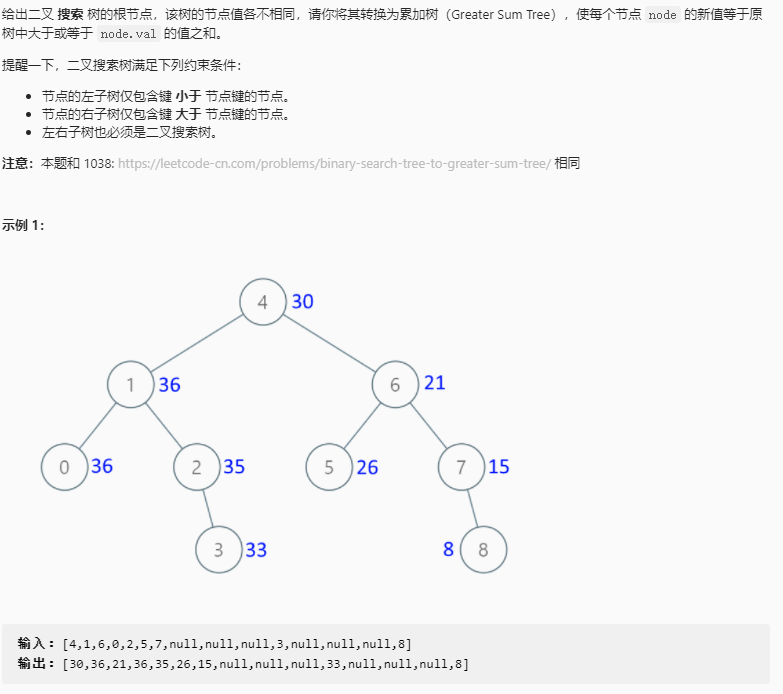

## 二叉搜索树转换为累加树

### 题目链接

[LeetCode: 538. 二叉搜索树转换为累加树](https://leetcode-cn.com/problems/convert-bst-to-greater-tree/)



### 思路分析

函数签名如下：

```java
    public TreeNode convertBST(TreeNode root)
```

函数的定义：传入一个二叉搜索树的根节点 root， 将每个节点的值转为所有大于或等于其节点的值之和

由二叉搜索树的性质可得，二叉搜索树的中序遍历是升序序列，如果把递归顺序改一下，得到的就是单调递减的降序序列

那么遍历到每一个节点的过程中经过的节点就都是大于它的节点，再加上它自己就是所有满足条件的节点，将这些节点的值累加再赋作当前节点的新值即可

### 代码实现

```java
public class TreeNode {
    int val;
    TreeNode left;
    TreeNode right;
    TreeNode() {}
    TreeNode(int val) { this.val = val; }
    TreeNode(int val, TreeNode left, TreeNode right) {
        this.val = val;
        this.left = left;
        this.right = right;
    }
}

class Solution {
    
    int sum;
    public TreeNode convertBST(TreeNode root){
        if (root == null)
            return null;
        convertBST(root.right);
        // 累加所有遍历过节点值
        sum += root.val;
        // 更新当前节点的值
        root.val = sum;
        convertBST(root.left);
        return root;
    }
}
```


