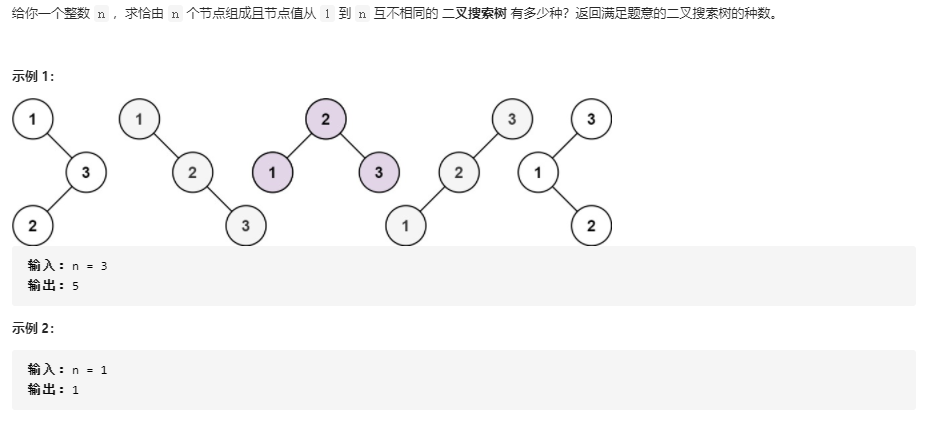

# 不同的二叉搜索树

## 题目链接

[96. 不同的二叉搜索树](https://leetcode-cn.com/problems/unique-binary-search-trees/)



## 思路分析

函数签名如下：

```java
public int numTrees(int n)
```

函数的定义：给定一个整数 n，求由 n 个节点可以组成互补相同的 BST 的个数

构建以一颗二叉树先要构造根节点，从 1 到 n 每一个数都能作为根节点的值，共有 n 种不同的根节点，再计算由这 n 个根节点可构成的 BST 的个数

节点区间为 [1, n], 假设根节点为 i，根据 BST 的性质，则 [1, i) 为根节点的左子树，(i, n] 为根节点的右子树

那么以 i 为根节点的可构成的 BST 的个数为：左子树中的 BST 个数 * 右子树中的 BST 个数

左右子树递归计算它们的 BST 个数即可

## 代码实现

```java
class Solution{

    // 备忘录，缓存重叠区间结果
    int[][] memo;
    public int numTrees(int n){
        memo = new int[n + 1][n + 1];
        return count(1, n);
    }

    int count(int lo, int hi){
        if(lo > hi)
            return 1;

        if(memo[lo][hi] != 0)
            return memo[lo][hi];

        int res = 0;
        for(int i = lo; i <= hi; i++){
            int left = count(lo, i -1);
            int right = count(i + 1, hi);
            res += left * right;

        }
        memo[lo][hi] = res;

        return res;
    }
}
```
