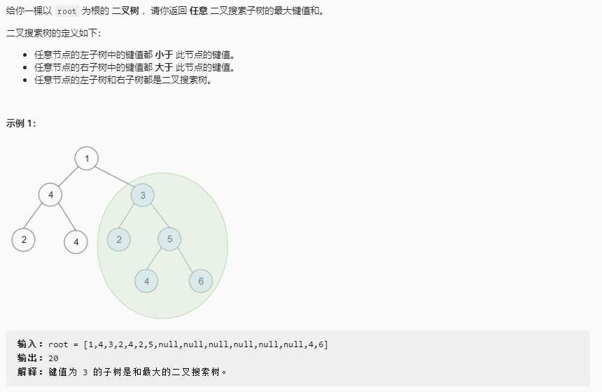

# 二叉搜索子树的最大键值和

## 题目链接

[LeetCode: 1373.二叉搜索子树的最大键值和](https://leetcode-cn.com/problems/maximum-sum-bst-in-binary-tree/)



## 思路分析

函数签名如下：

```java
public int maxSumBST(TreeNode root)
```

## 代码实现
