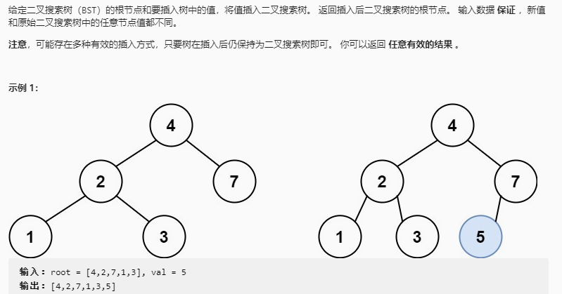

## 二叉搜索树中的插入操作

### 题目链接

[LeetCode：701. 二叉搜索树中的插入操作](https://leetcode-cn.com/problems/insert-into-a-binary-search-tree/)



### 思路分析

函数签名如下：

```java
    public TreeNode insertIntoBST(TreeNode root, int val)
```
函数的定义：传入一个BST的根节点 root 和需要插入的值，返回插入后BST的根节点

通过BST的特性查找节点插入的位置即可

### 代码实现

```java
class Sulotion{
    public TreeNode insertIntoBST(TreeNode root, int val){
        if(root == null)
            return new TreeNode(val);

        if(val < root.val)
            root.left = insertIntoBST(root.left, val);
        if(val > root.val)
            root.right = insertIntoBST(root.right, val);
        return root;
    }
}

```


