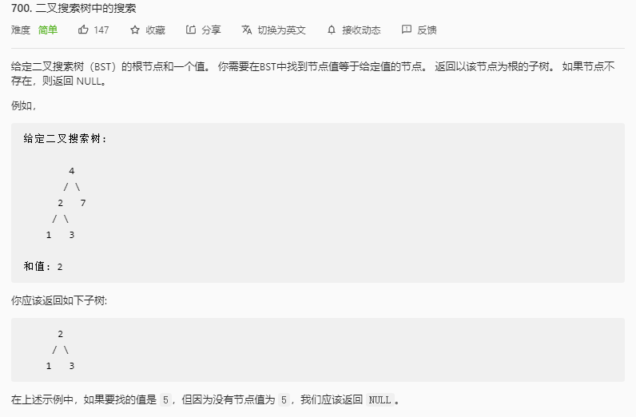

## 二叉树中的搜索

### 题目链接

[LeetCode：700. 二叉搜索树中的搜索](https://leetcode-cn.com/problems/search-in-a-binary-search-tree/)



### 思路分析

函数签名如下：

```java
  public TreeNode searchBST(TreeNode root, int val)
```

函数的定义：传入一个二叉搜索树的根节点和要查找的值，返回该值所在子树的根节点

根据二叉搜索树的定义，节点的左子树只包含小于当前节点的数，节点的右子树只包含大于当前节点的数，所有左子树和右子树自身也是二叉搜索树

所以当查找值小于当前节点的值时，只需要在左子树中查找，当查找值大于当前节点的值时，只需要在右子树中查找。

### 代码实现

```java
class Solution {
  public TreeNode searchBST(TreeNode root, int val){
    if(root == null)
      return null;
    if(val == root.val) return root;
    if(val < root.val) return searchBST(root.left, val);
    if(val > root.val) return searchBST(root.right, val);
    return null;
  }
}

```
