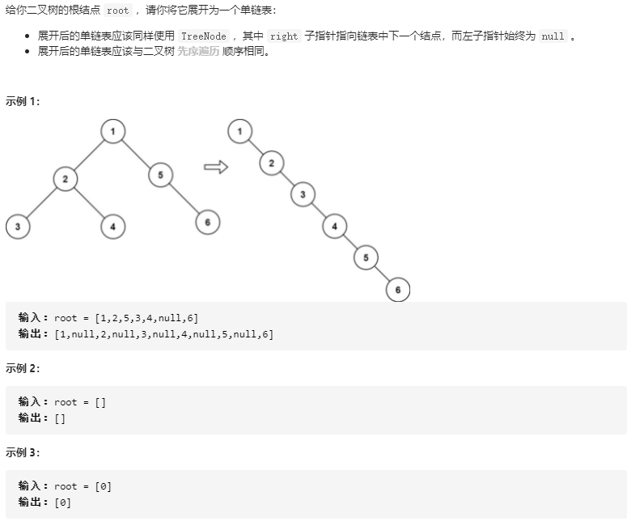

## 二叉树展开为链表

### 题目链接

[LeetCode: 114. 二叉树展开为链表](https://leetcode-cn.com/problems/flatten-binary-tree-to-linked-list/)



### 思路分析

函数签名如下：

```java
    public void flatten(TreeNode root)
```
函数的定义：传入一个参数二叉树根节点 root， 将其展开为一个单链表

要将整个二叉树展开为一个单链表，则要将其每个子树先展开为一个单链表

那么就要对每个以 root 为根的树的左右子节点递归调用 flattern 函数：

```java
class Solution {
    public void flatten(TreeNode root) {
        flatten(root.left);
        flatten(root.right);
    }
}
```
则函数参数中的变量为 root， 当 root 为 null 时，说明到达叶子节点，应该返回

递归调用的结果为以 root 为根的树的每个节点：root、root.left、root.right

题目要求展开后的链表要与二叉树的先序遍历顺序相同，并且将单链表作为右子树

即得到递归调用的结果后，将以 root 为根的树的左节点作为右节点，并指向原来的右节点

### 代码实现

```java
class Solution {
    public void flatten(TreeNode root) {
        if (root == null)
            return;
        flatten(root.left);
        flatten(root.right);
        
        TreeNode left = root.left;
        TreeNode right = root.right;
        // 将左子树指向空
        root.left = null;
        // 将右子树指向原来的左子树
        root.right = left;
        
        // 找到右子树的叶子节点
        TreeNode p = root;
        while (p.right != null)
            p = p.right;
        // 原来的右子树接到叶子节点的末端
        p.right = right;
    }
}
```


