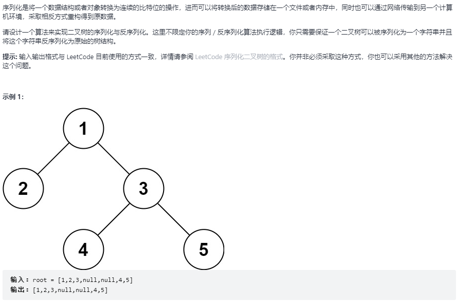

# 二叉树的序列化与反序列化

## 题目链接

[LeetCode: 297.二叉树的序列化与反序列化](https://leetcode-cn.com/problems/serialize-and-deserialize-binary-tree/)



## 思路分析

函数签名如下：

```java
public String serialize(TreeNode root)

public TreeNode deserialize(String data)
```

采用后序遍历序列化二叉树

对序列化后得到的字符串进行切割，采用前序遍历反序列化构造二叉树

## 代码实现

```java
class Solution{
    String separator = ",";
    public String serialize(TreeNode root){
        if(root == null)
            return "#";
        return serialize(root.left) + separator + serialize(root.right) + separator + root.val;
    }

    public TreeNode deserialize(String data){
        String[] arr = data.split(separator);
        LinkedList<String> list = new LinkedList<>();
        for(String key : arr){
            list.add(key);
        }
        return build(list);
    }

    TreeNode build(LinkedList<String> list) {
        if(list.size() == 0){
            return null;
        }

        String node = list.removeLast();
        if(node.equals("#")){
            return null;
        }
        TreeNode root = new TreeNode(Integer.parseInt(node));
        root.right = build(list);
        root.left = build(list);
        return root;
    }
}
```
