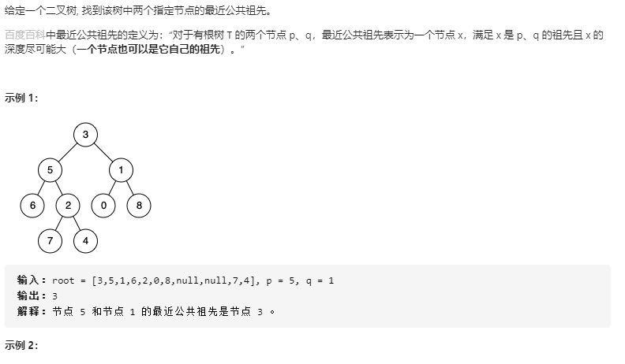

## 二叉树的最近公共祖先

### 题目链接

[LeetCode: 236. 二叉树的最近公共祖先](https://leetcode-cn.com/problems/lowest-common-ancestor-of-a-binary-tree/)



### 思路分析
函数签名如下：
```java
 public TreeNode lowestCommonAncestor(TreeNode root, TreeNode p, TreeNode q)
```

对于递归型的问题，首先考虑三个问题：
1. 这个函数是干嘛的
2. 这个函数参数中的变量是什么
3. 得到函数的递归结果后应该干什么

**这个函数是干嘛的**
或者说 lowestCommonAncestor() 这个函数的定义：

给该函数输入三个参数root, p, q, 它会返回一个节点。具体有以下情况：
1. 如果 p 和 q 都在以 root 为根的树中，函数会返回它们的最近公共祖先的节点
2. 如果 p 和 q 只有一个存在于以 root 为根的树中， 函数就会返回那个节点
3. 如果 p 和 q 都不存在于以 root 为根的树中， 函数返回null

**这个函数参数中的变量是什么**
或者说描述一个这个函数的状态：

函数参数中的变量是 root，因为 lowestCommonAncestor() 会递归调用 root.left 和 root.right；

对于 root，如果 root 为空，则返回 null；如果 root 为 p 或 q，则另一个节点无论是否在以 root 为根的树中，都应该返回root。

**得到函数的递归结果后应该干什么**
或者说得到递归调用的结果，做什么选择：

这里递归调用的结果即为 left 和 right，

用 left 与 right 结合第一个问题再分析：  
1. 如果 p 和 q 都在以 root 为根的树中， 则 left 和 right 一定是 p 和 q， 则 root 即为公共先祖
2. 如果 p 和 q 只有一个在以 root 为根的树中，则返回那个节点
3. 如果 p 和 q 都不在以 root 为根的树中， 则返回null

### 代码实现

```java
class Solution{
    public TreeNode lowestCommonAncestor(TreeNode root, TreeNode p, TreeNode q){
        if(root == null) return null;
        if(root == p || root == q) return root;
        
        TreeNode left = lowestCommonAncestor(root.left, p, q);
        TreeNode right = lowestCommonAncestor(root.right, p, q);
        if(left != null && right != null)
            return root;
        if (left == null && right == null)
            return null;
        return left != null ? left : right;
    }
}
```


