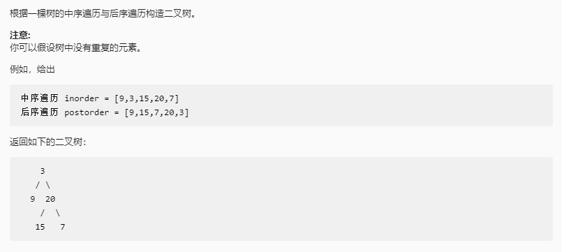

##  从中序与后序遍历序列构造二叉树

### 题目链接

[LeetCode: 106. 从中序与后序遍历序列构造二叉树](https://leetcode-cn.com/problems/construct-binary-tree-from-inorder-and-postorder-traversal/)




### 思路分析

函数签名如下：

```java
    public TreeNode buildTree(int[] inorder, int[] postorder)
```
函数的定义：传入一个二叉树的后序遍历数组和中序遍历数组，返回该二叉树

此题思路与 [从前序与中序遍历序列构造二叉树](https://github.com/CheneyKwok/algorithm-notes/blob/main/notes/%E4%BB%8E%E5%89%8D%E5%BA%8F%E4%B8%8E%E4%B8%AD%E5%BA%8F%E9%81%8D%E5%8E%86%E5%BA%8F%E5%88%97%E6%9E%84%E9%80%A0%E4%BA%8C%E5%8F%89%E6%A0%91.md)
的思路一致，先构造根节点，再递归构造左右子树

根据后序和中序的遍历顺序可知

[inLo, rootIndex - 1] 为 inorder 中的左子树， [rootIndex + 1, inHi] 为右子树, 右子树元素个数为 rightWidth = inHi - rootIndex

[postLo, postHi - rightWidth - 1] 为 postorder 中左子树， [ postHi - rightWidth, postHi - 1] 为右子树

### 代码实现

```java
class Solution {
    public TreeNode buildTree(int[] inorder, int[] postorder) {

        return build(inorder, 0, inorder.length - 1, postorder, 0, postorder.length - 1);

    }

    TreeNode build(int[] inorder, int inLo, int inHi, int[] postorder, int postLo, int postHi){
        if(inLo > inHi || postLo > postHi)
            return null;
        // 根节点的值
        int rootVal = postorder[postHi];
        // 根节点在中序遍历中的位置
        int rootIndex = inLo;
        for(int i = inLo; i <= inHi; i++){
            if(inorder[i] == rootVal){
                rootIndex = i;
                break;
            }
        }

        // 右子树宽度
        int rightWidth = inHi - rootIndex;

        // 构造根节点
        TreeNode root = new TreeNode(rootVal);

        // 构造左子树
        TreeNode left = build(inorder, inLo, rootIndex -1, postorder, postLo, postHi - rightWidth -1);

        // 构造右子树
        TreeNode right = build(inorder, rootIndex + 1, inHi, postorder, postHi - rightWidth, postHi - 1);

        root.left = left;
        root.right = right;

        return root;
    }
}
```
然而对于查找根节点，每一个递归都重新遍历数组查找是比较费时的，可以借助哈希表事先将元素的值和下标作为键值对存储起来

优化后：

```java
class Solution {

    Map<Integer, Integer> indexMap = new HashMap<>();
    
    public TreeNode buildTree(int[] inorder, int[] postorder) {
         for(int i = 0; i < inorder.length; i++){
             indexMap.put(inorder[i], i);
         }
         
         return build(inorder, 0, inorder.length - 1, postorder, 0, postorder.length - 1);

    }

    TreeNode build(int[] inorder, int inLo, int inHi, int[] postorder, int postLo, int postHi){
        if(inLo > inHi || postLo > postHi)
            return null;
        // 根节点的值
        int rootVal = postorder[postHi];
        // 根节点在中序遍历中的位置
        int rootIndex = indexMap.get(rootVal);

        // 右子树宽度
        int rightWidth = inHi - rootIndex;

        // 构造根节点
        TreeNode root = new TreeNode(rootVal);
        
        // 构造左子树
        TreeNode left = build(inorder, inLo, rootIndex -1, postorder, postLo, postHi - rightWidth -1);

        // 构造右子树
        TreeNode right = build(inorder, rootIndex + 1, inHi, postorder, postHi - rightWidth, postHi - 1);

        root.left = left;
        root.right = right;

        return root;
    }
}
```


