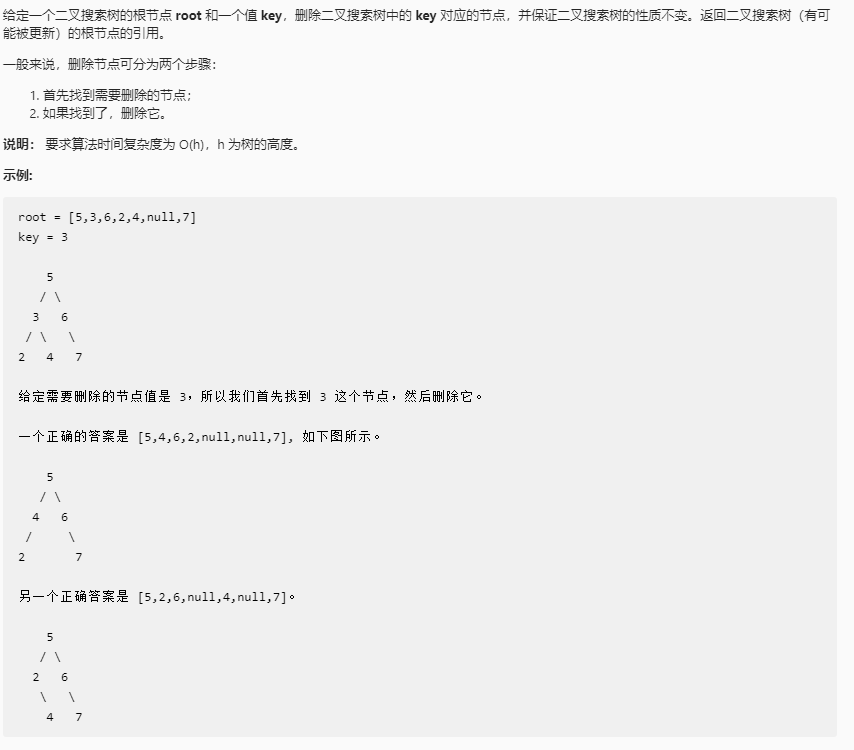

# 删除二叉搜索树中的节点

## 题目链接

[LeetCode: 450. 删除二叉搜索树中的节点](https://leetcode-cn.com/problems/delete-node-in-a-bst/)



## 思路分析

函数签名如下：

```java
public TreeNode deleteNode(TreeNode root, int key)

```

删除一个节点，首先要找到这个节点的位置，其次要保证删除后的二叉树依然满足BST的条件

要删除的节点有以下情况：

- 叶子节点
  
  此时直接将该节点删除即可

  ```java
  if(root.left == null && root.right == null)
    return null;
  ```

- 只有左子树或只有右子树
  
  让其左子树或右子树接替它的位置

  ```java
  return root.left == null ? root.right : root.left;
  ```

- 既有左子树又有右子树
  
  此时有两种方法：

  - 找出左子树中含有最大值的节点接替被删除节点位置，再去删除这个节点
  - 找出右子树中含有最小值的节点接替被删除节点位置，再去删除这个节点
  
  ```java
  if(root.left != null && root.right != null){
      TreeNode max = getMax(root.left);
      root.val = max.val;
      root.left = deleteNode(root.left, max.val);
  }
  ```

## 代码实现

```java
class Solution{
     public TreeNode deleteNode(TreeNode root, int key){
         if(root == null) return null;
         if(key == root.val){
             if(root.left == null) return root.right;
             if(root.right == null) return root.left;
             TreeNode min = getMin(root.right);
             root.val = min.val;
             root.right = deleteNode(root.right, min.val);
         }
         if(key > root.val){
             root.right = deleteNode(root.right, key);
         }
         if(key < root.val){
             root.left = deleteNode(root.left, key);
         }
         return root;
     }
     TreeNode getMin(TreeNode root){
         while(root.left != null) root = root.left;
         return root;
     }
}
```

再由此得出删除二叉树中的节点

 ```java
 class Solution{
     public TreeNode deleteNode(TreeNode root, int key){
         if(root == null) return null;

         if(key == root.val){
                if(root.left == null && root.right == null)
                    return null;
                if(root.left != null && root.right != null){
                    // 找到合适的代替节点
                    TreeNode node = getNode(root, root);
                    root.val = node.val;
                    return deleteNode(root, node.val);
                }
                return root.left == null ? root.right : root.left;
         }
        root.left = deleteNode(root.left, key);
        root.right = deleteNode(root.right, key);
        
        return root;
        
     }

     TreeNode getNode(TreeNode root, TreeNode node){
         if(root == null)
            return node;
         if(满足条件) node = root;
         node = getNode(root.left, node);
         node = getNode(root.right, node);
         return node;
     }
 }
```
