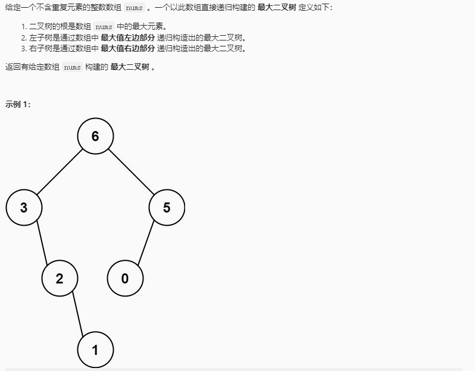
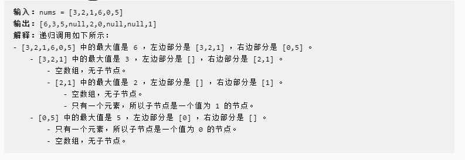

## 最大二叉树

### 题目链接

[LeetCode: 654. 最大二叉树](https://leetcode-cn.com/problems/maximum-binary-tree/)




### 思路分析

函数签名如下：

```java
    public TreeNode constructMaximumBinaryTree(int[] nums)
```
函数的定义：传入一个整数数组，根据题意递归构建出一个最大二叉树

要构建一颗树，首先要构造它的根节点。如何构造根节点，题目已经说明：

```text
    二叉树的根是数组 nums 中的最大元素
```

即遍历 nums 数组查找出最大值 nums[max], 然后构造根节点 root = new TreeNode(nums[max])

构造完根节点，还有左右子树，根据题意，左右子树是通过数组中的最大值的左右部分递归构造的又一最大二叉树

那么只要将 nums 换成最大值的左右数组 [lo, hi] 再次递归调用构造出最大二叉树 left 和 right，即为 root 的左右子树

所有需要一个辅助函数：
```java
    TreeNode build(int[] nums, int lo, int hi)
```

### 代码实现

```java
class Solution{
    public TreeNode constructMaximumBinaryTree(int[] nums){
        return build(nums, 0, nums.length - 1);
    }

    TreeNode build(int[] nums, int lo, int hi){
        if(lo > hi)
            return null;
        int maxIndex = lo;
        // 注意等号
        for (int i = lo; i <= hi; i++) {
            if (nums[i] > nums[maxIndex])
                maxIndex = i;
        }
        // 构造根节点
        TreeNode root = new TreeNode(nums[maxIndex]);

        // 构造左子树
        TreeNode left = build(nums, lo, maxIndex -1);
        // 构造右子树
        TreeNode right = build(nums, maxIndex + 1, hi);
        
        root.left = left;
        root.right = right;
        return root;
    }
}
```

