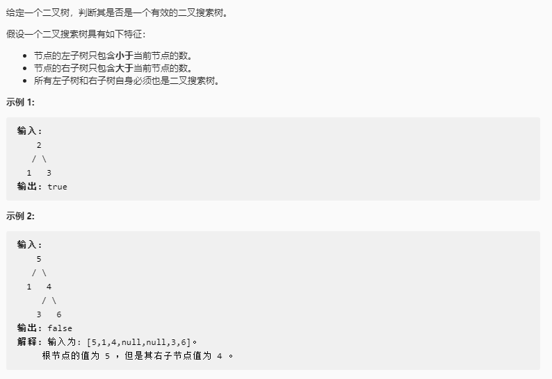

## 验证二叉搜索树

### 题目链接

[LeetCode: 98. 验证二叉搜索树](https://leetcode-cn.com/problems/validate-binary-search-tree/)



### 思路分析

函数签名如下：

```java
    public boolean isValidBST(TreeNode root)
```

函数的定义：传入二叉搜索树的根节点 root，判断该树是否是二叉搜索树BST

根据BST的定义，对于每一个节点 root， root 的左子树的节点值都要小于 root.val，右子树的节点值都要大于 root.val

则左子树的节点值 left.val < root.val, 而 root 又可能是其他子树的右节点，此时 root 需满足 root.val > min ( 所有可能子树根节点的最小值)

所以左子树的节点值应该 min < left.val < root.val

同理可得右子树的节点值应该满足：root.val < right.val < max (所有可能子树根节点的最大值)

那么每一个节点 root 则应该满足： min < root.val < max

由此可得辅助函数的构造为：

```java
    boolean valid(TreeNode root, TreeNode min, TreeNode max){}
```

### 代码实现

```java

public class TreeNode{
    int val;
    TreeNode left;
    TreeNode right;
    public TreeNode(int val){
        this.val = val;
    }
    public TreeNode(int val, TreeNode left, TreeNode right){
        this.val = val;
        this.left = left;
        this.right = right;
    }
}
class Solution{
    public boolean isValidBST(TreeNode root){
        if(root == null)
            return false;
        return valid(root, null, null);
    }
    
    boolean valid(TreeNode root, TreeNode min, TreeNode max){
        if (root == null)
            return true;
        if (min != null && root.val <= min.val) return false;
        if (max != null && root.val >= max.val) return false;
        return valid(root.left, min, root) && valid(root.right, root, max);
    }
}
```


