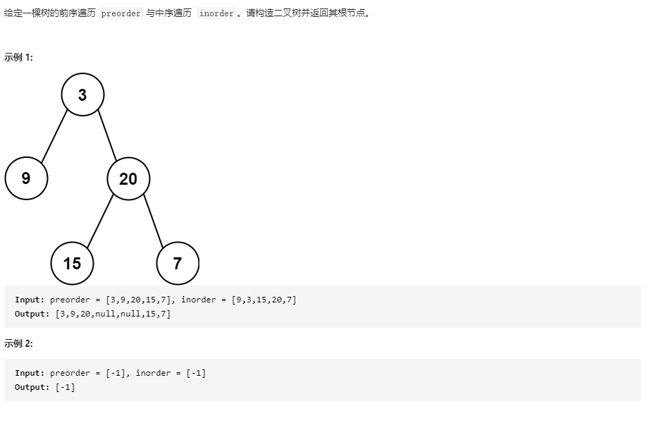

##  从前序与中序遍历序列构造二叉树

### 题目链接

[LeetCode: 105. 从前序与中序遍历序列构造二叉树](https://leetcode-cn.com/problems/construct-binary-tree-from-preorder-and-inorder-traversal/)



### 思路分析

函数签名如下：

```java
    public TreeNode buildTree(int[] preorder, int[] inorder)
```
函数的定义：传入一个二叉树的前序遍历数组和中序遍历数组，返回该二叉树

1. 如何构造二叉树

任何树都需要根节点，所以第一步要找到根节点，将根节点 root 构造出来，

其次需要构造出以当前 root 为根节点的树的左节点，

而左节点对于它下面的子节点来说又是它们的根节点，所以只要将当前构造的范围缩小至 root 的左子树元素，再次递归构造节点，即为 root 的左节点

然后再同理递归构造出右节点。

2. 如何找到根节点 root

观察二叉树的前序遍历和中序遍历的特性

前序遍历的顺序是根节点、左节点、右节点，所以 preorder[0] 即为根节点 root 的值 rootVal，依次往后是所有的左节点，所有的右节点

中序遍历的顺序是左节点、根节点、右节点，即只通过 inorder 无法知道 root 的位置，

但通过前序遍历得到的根节点的值 rootVal，可以很容易计算出 root 在 inorder 中的位置 rootIndex,

3. 如何确定左右子树的范围

假设每一次递归传入的 preorder 区间为 [preLo, preHi], inorder 区间为 [inLo, inHi]

根据前序和中序的遍历顺序可知

[inLo, rootIndex - 1] 为 inorder 中的左子树， [rootIndex + 1, inHi] 为右子树, 左子树元素个数为 leftWidth = rootIndex - inLo

[preLo + 1, preLo + leftWidth] 为 preorder 中左子树， [ preLo + leftWidth + 1, preHi] 为右子树

### 代码实现

```java
class Solution {
    public TreeNode buildTree(int[] preorder, int[] inorder) {
        return build(preorder, 0, preorder.length -1, inorder, 0, inorder.length -1);
    }

    TreeNode build(int[] preorder, int preLo, int preHi, int[] inorder, int inLo, int inHi){
        if(preLo > preHi || inLo > inHi)
            return null;
        // 根节点值
        int rootVal = preorder[preLo];
        // 查找中序遍历中的根节点位置
        int rootIndex = inLo;
        for(int i = inLo; i <= inHi; i++){
            if(inorder[i] == rootVal){
                rootIndex = i;
                break;
            }
        }
        // 左子树个数
        int leftWidth = rootIndex - inLo;
        // 构造根节点
        TreeNode root = new TreeNode(rootVal);
        // 构造左子树
        TreeNode left = build(preorder, preLo + 1, preLo + leftWidth, inorder, inLo, rootIndex -1);
        // 构造右子树
        TreeNode right = build(preorder, preLo + leftWidth + 1, preHi, inorder, rootIndex + 1, inHi);

        root.left = left;
        root.right = right;

        return root;

    }
}
```


