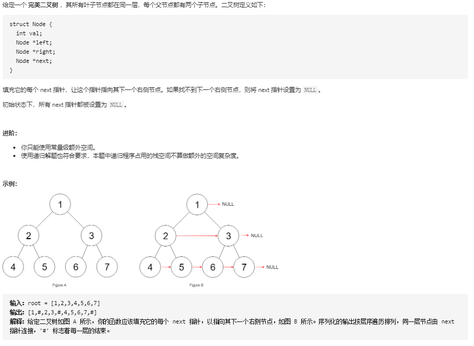

## 填充二叉树节点的右侧指针

### 题目链接

[LeetCode: 116. 填充每个节点的下一个右侧节点指针](https://leetcode-cn.com/problems/populating-next-right-pointers-in-each-node/)



### 思路分析

函数签名如下：

```java
    public Node connect(Node root)
```
函数的定义：传入一个以 root 为根节点的二叉树的 root 节点，填充 root 及其所有子节点的右侧指针， 即将相邻的两个节点连接

那么是否递归调用 connect 函数将 root 的左右子节点连接就可以了，即如下代码实现：

```java
class Solution{
    public Node connect(Node root){
        if (root == null || root.left == null)
            return root;
        
        root.left.next = root.right;
        connect(root.left);
        connect(root.right);
        return root;
    }
}
```

如果只是递归调用 connect 函数对 root 进行处理，只能将 root 的两个子节点连接，结果如下：


而根据题目要求，不同父节点的两个相邻子节点也应该被连接

所以只通过一个节点是无法将不同父节点的相邻节点连接的，既然一个节点不行，那就两个节点

构建一个辅助函数，函数定义为：传入的两个节点，将两个节点及它们的所有相邻的子节点两两连接

代码实现：

```java
class Solution{
    public Node connect(Node root) {
        if (root == null || root.left == null)
            return root;

        connectTwo(root.left, root.right);
        return root;
    }

    // 辅助函数
    public void connectTwo(Node n1, Node n2) {
        if (n1 == null)
            return;
        n1.next = n2;
        
        connectTwo(n1.left, n1.right);
        connectTwo(n2.left, n2.right);
        connectTwo(n1.right, n2.left);
    }
}

```

