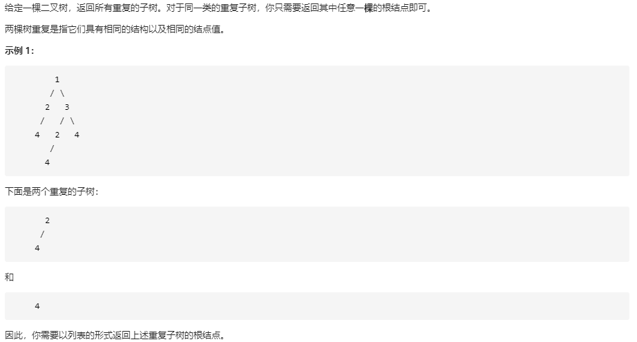

## 寻找重复子树

### 题目链接

[LeetCode: 652. 寻找重复的子树](https://leetcode-cn.com/problems/find-duplicate-subtrees/)



### 思路分析

函数签名如下：

```java
    public List<TreeNode> findDuplicateSubtrees(TreeNode root)
```

函数定义：传入一个二叉树的根节点 root， 寻找所有重复的子树，返回包含重复子树根节点的集合

先看如何寻找子树，二叉树的通用遍历框架：

```java
class Solution{
    public TreeNode traversal(TreeNode root){
        TreeNode left = traversal(root.left);
        TreeNode right = traversal(root.right);
        return root;
    }
}
```

每一次遍历得到的结果 root、left、right就是当前以 root 为根节点的子树根节点、左节点、右节点

那么如何判断重复，只需要将每一次遍历得到的子树**序列化**后放入缓存，如果缓存中已有，就是重复子树

### 代码实现

```java
class Solution{
    
    // tree - 次数
    Map<String, Integer> treeMap;
    
    List<TreeNode> res;

    public List<TreeNode> findDuplicateSubtrees(TreeNode root){
        treeMap = new HashMap<>();
        res = new ArrayList<>();
        traversal(root);
        return res;
    }
    
    public String traversal(TreeNode root){
        // 以 # 代表空
        if (root == null)
            return "#";
        String left = traversal(root.left);
        String right = traversal(root.right);
        
        String tree = left + root.val + right;
        int count = treeMap.getOrDefault(tree, 0);
        if (count == 1) res.add(root);
        treeMap.put(tree, ++count);
        return tree;
    }
}

```


