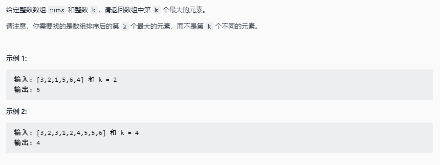

# 快速排序

快速排序，又称分区交换排序。在平均情况下，时间复杂度的为 $O(nlogn)$，在最坏情况下为 $O(n^2)$

## 步骤


- 挑选基准值：从数列中挑出一个元素作为基准
- 分割：所有比基准值小的元素摆放在基准前，所有比基准值大的元素摆放在基准后（与基准值相等的数可以放在任何一边）。
- 递归排序子序列：递归地将小于基准值的子序列和大于基准值的子序列排序

## 实现

```java
void quickSort(int[] nums, int lo, int hi){
    if(lo > hi){
        return;
    }
    int i = lo,j = hi;
    int pivot = nums[i];
    while(i != j){
        while(j > i && nums[j] >= pivot){
            j--;
        }
        nums[i] = nums[j];
        while(i < j && nums[i] <= pivot){
            i++;
        }
        nums[j] = nums[i]
    }
    nums[i] = pivot;
    quickSort(nums, lo, i -1);
    quickSort(nums, i + 1, hi);
}
```

## 思考

- **为什么叫快速排序，是所有排序里性能最好的吗**

  快排的性能在所有排序算法中的是最好的，数据规模越大快排的性能越优越。

- **快排适合什么情况，还是无论什么情况下快排总是最好的**
  
  快排在极端情况下，也就是每次划分所取的基准数总是数组中最小的情况下，会退化成 $O(n^2)$ 的算法，因此假如在提前得知处理数据可能会出现极端情况的前提下，可以选择使用较为稳定的归并排序。

- **快排算法的思想是什么？其性能优良的原因是依赖于算法中的哪个部分**
  
  快排的思想是分治与递归，依赖于与一个基准数比较将数列不断分区并只在自己所在区间内排序，不会存在重叠比较的问题。

## 应用

### 数组中的第K个最大元素

#### 题目链接

[Leetcode 215. 数组中的第K个最大元素](https://leetcode-cn.com/problems/kth-largest-element-in-an-array/)



##### 代码实现

```java
class Solution {
    public int findKthLargest(int[] nums, int k) {
        sort(nums, 0, nums.length -1);
        return nums[nums.length -k];
    }

    void sort(int[] nums, int lo, int hi){
        if(lo > hi) return;
        int start = lo;
        int end = hi;
        int tmp = nums[lo];

        while(lo != hi){
            while(lo < hi && nums[hi] >= tmp){
                hi--;
            }
            nums[lo] = nums[hi];
            while(lo < hi && nums[lo] <= tmp){
                lo ++;
            }
            nums[hi] = nums[lo];
        }
        nums[lo] = tmp;

        sort(nums, start, lo -1);
        sort(nums, lo + 1, end);
    }
}
```
