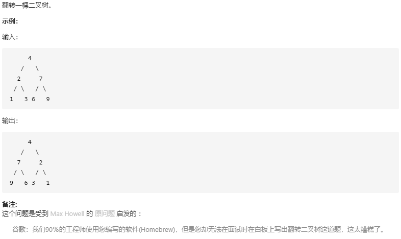

## 翻转二叉树

### 题目链接
 
[LeetCode：226. 翻转二叉树](https://leetcode-cn.com/problems/invert-binary-tree/)



### 思路分析

函数签名如下：

```java
    public TreeNode invertTree(TreeNode root)
```
对于二叉树的遍历，先写出通用遍历框架：

```java
class Solution {
    public TreeNode invertTree(TreeNode root) {
        TreeNode left = invertTree(root.left);
        TreeNode right = invertTree(root.right);
        return root;
    }
}
```
函数参数中的变量是 root，递归调用得到的结果为 left 和 root，

题目要求我们翻转此二叉树，不难发现将每一个以 root 为根的树中的左右子节点交换，即可实现。

而在后序遍历中，left 和 right 就是当前以 root 为根的树中的左右子节点。

### 代码实现

```java
class Solution {
    public TreeNode invertTree(TreeNode root) {
        
        if (root == null) return root;
        
        TreeNode left = invertTree(root.left);
        TreeNode right = invertTree(root.right);
        
        root.left = right;
        root.right = left;
        return root;
    }
}
```

