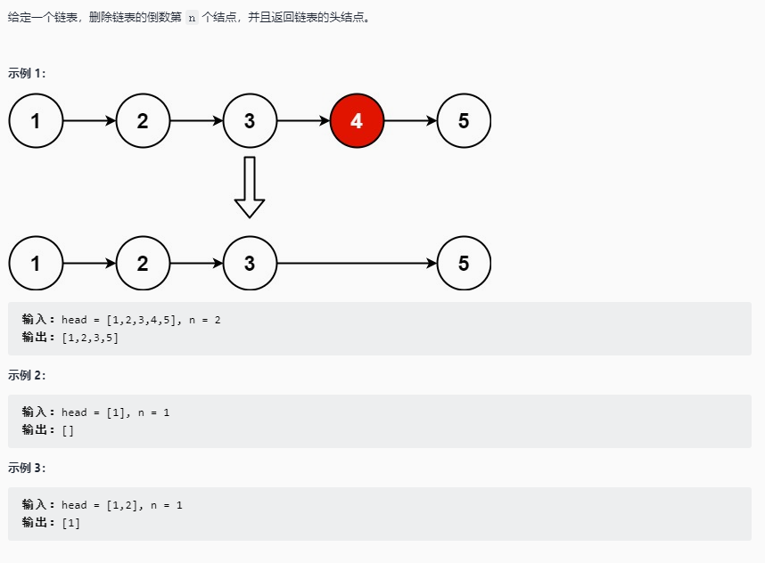

# 删除链表的倒数第 n 个结点

## 题目链接

[LeetCode: 剑指 Offer II 021. 删除链表的倒数第 n 个结点](https://leetcode-cn.com/problems/SLwz0R/)



## 思路分析

函数签名如下

```java
public ListNode removeNthFromEnd(ListNode head, int n)
```

要删除链表的一个节点，需要知道它的前置节点，例如 pre.next = node; pre.next = pre.next.next; 即删除节点 node

所以找到链表的倒数第 n+ 1 个结点，([链表中倒数第k个节点](https://leetcode-cn.com/problems/lian-biao-zhong-dao-shu-di-kge-jie-dian-lcof/)) 再删除即可

需要注意的是如果删除的是头节点，那么其前置节点是为空的，所以需要用一个虚拟节点作头节点的前置节点

## 代码实现

```java
class Solution{
    public ListNode removeNthFromEnd(ListNode head, int n){
        ListNode dummy = new ListNode();
        dummy.next = head;
        ListNode pre = findNthFromEnd(dummy, n+1);
        pre.next = pre.next.next;
        return dummy.next;

    }

    ListNode findNthFromEnd(ListNode head, int n){
        ListNode p1 = head;
        for(int i = 0;i < n;i++){
            p1 = p1.next;
        }

        ListNode p2 = head;
        while(p1 != null){
            p1 = p1.next;
            p2 = p2.next;
        }

        return p2;
    }
}
```
