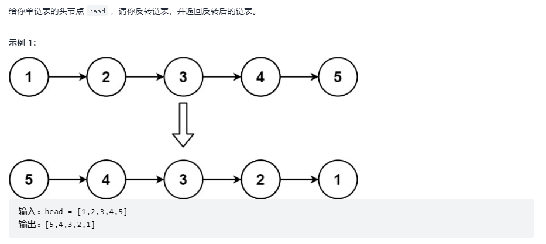

# 反转链表

## 题目链接

[Leetcode 206. 反转链表](https://leetcode-cn.com/problems/reverse-linked-list/)



## 思路分析

函数签名如下：

```java
public ListNode reverseList(ListNode node)
```

方法一：迭代

假设反转后的新链表为 p，迭代遍历原链表 head，用指针 curr 引用 head，head 位移一下节点 head.next

将 curr.next 指向 p，更新 p 指向 curr

方法二：递归

将反转整个链表细分为反转两个节点

假设节点 p1、p2

```java
p1.next = p2;
p2.next = null;
```

将 p1.next = null，p2.next = p1 (p1.next.next = p1) 即可

则递归的关键步骤为：

```java
ListNode last = head.next;
head.next.next = head;
head.next = null;
```

## 代码实现

方法一：

```java
class Solution {
    public ListNode reverseList(ListNode head) {
      ListNode p = null;
      while(head != null){
          ListNode curr = head;
          head = head.next;
          curr.next = p;
          p = curr;
      }
      return p;
    }
}
```

方法二：

```java
class Solution {
    public ListNode reverseList(ListNode head) {
        if(head == null || head.next == null)
            return head;
        ListNode last = reverseList(head.next);
        head.next.next = head;
        head.next = null;
        // 返回反转后的链表头引用
        return last;
    }

```
