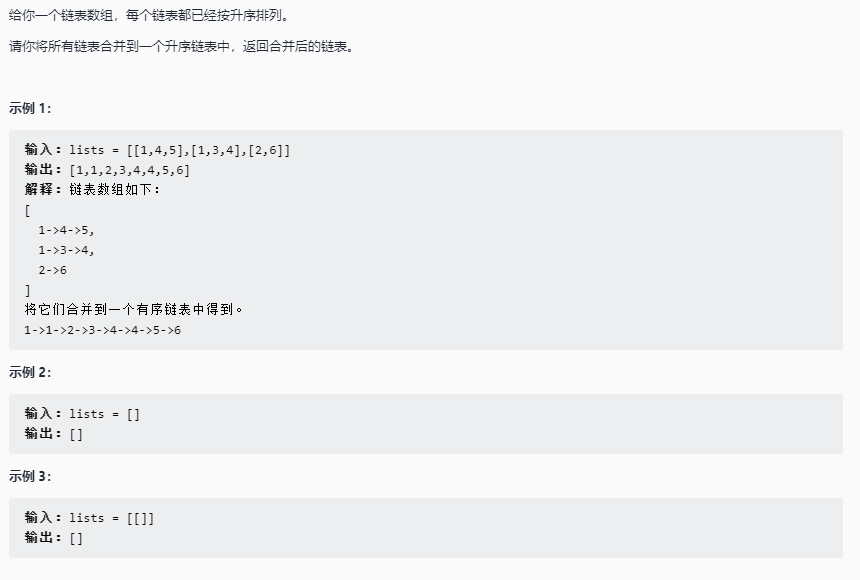

# 合并K个升序链表

## 题目链接

[LeetCode: 23. 合并K个升序链表](https://leetcode-cn.com/problems/merge-k-sorted-lists/)



## 思路分析

函数签名如下：

```java
public ListNode mergeKLists(ListNode[] lists)
```
解法一：

拆分为[合并两个升序链表](https://github.com/CheneyKwok/algorithm-notes/blob/main/notes/链表/合并两个有序链表.md)的问题，
用一个变量维护合并后链表，依次与 lists 中的链表合并

解法二：

将 lists 中的链表节点放入优先级队列（ PriorityQueue）中，每次取出节点值最小的进行合并

## 代码实现

### 解法一

- 递归实现

```java
class Sulotion{
    public ListNode mergeKLists(ListNode[] lists){
        ListNode res = null;
        for(ListNode head : lists){
            res = mergeTwoLists(res, head);
        }

        return res;

    }

    ListNode mergeTwoLists(ListNode l1, ListNode l2){
        if(l1 == null || l2 == null)
            return l1 != null ? l1  : l2;
        
        if(l1.val > l2.val){
            l2.next = mergeTwoLists(l1, l2.next);
            return l2;
        }else{
            l1.next = mergeTwoLists(l1.next, l2);
            return l1;
        }
    }
}
```
- 双指针实现

```java
class Sulotion{
    public ListNode mergeKLists(ListNode[] lists){
        ListNode res = null;
        for(ListNode head : lists){
            res = mergeTwoLists(res, head);
        }

        return res;

    }

    ListNode mergeTwoLists(ListNode l1, ListNode l2){
        ListNode head = new ListNode();
        ListNode curr = head;

        while(l1 != null && l2 != null){
            if(l1.val > l2.val){
                curr.next = l2;
                l2 = l2.next;
            }else{
                curr.next = l1;
                l1 = l1.next;
            }
            curr = curr.next;
        }

        if(l1 != null) curr.next = l1;
        if(l2 != null) curr.next = l2;

        return head.next; 
    }
}
```

### 解法二

- 一次性全部放入优先级队列
  
```java
class Sulotion{

    public ListNode mergeKLists(ListNode[] lists){
        PriorityQueue<ListNode> queue = new PriorityQueue<>((x, e) -> x.val -e.val);

        for(ListNode head : lists){
            while(head != null){
                queue.add(head);
                head = head.next;
            }
        }

        ListNode node = new ListNode();
        ListNode curr = node;
        while(queue.size() > 0){
            curr.next = queue.poll();
            curr = curr.next;
        }

        return node.next;

    }
}
```
- 边出队边入队（入队时比较的元素会越来越少，效率越来越高）
  
```java
class Sulotion{

    public ListNode mergeKLists(ListNode[] lists){
        PriorityQueue<ListNode> queue = new PriorityQueue<>((x, e) -> x.val -e.val);

        for(ListNode head : lists){
            if(head != null)
                queue.add(head);
            
        }

        ListNode node = new ListNode();
        ListNode curr = node;
        while(queue.size() > 0){
            ListNode poll = queue.poll();
            curr.next = poll;
            if(poll.next != null)
                queue.add(poll.next);
            curr = curr.next;
        }

        return node.next;

    }
}
```


