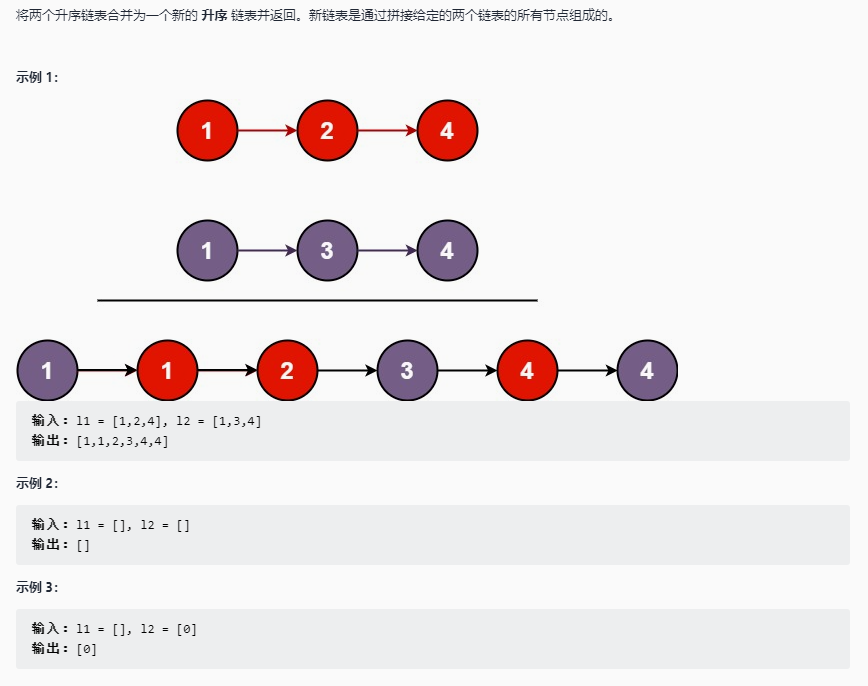

# 合并两个有序链表

## 题目链接

[LeetCode: 21. 合并两个有序链表](https://leetcode-cn.com/problems/merge-two-sorted-lists/)



## 思路分析

函数签名如下：

```java
public ListNode mergeTwoLists(ListNode l1, ListNode l2)
```

函数的定义：传入两个升序链表，返回合并后的升序链表

同时遍历两个链表，比较节点值大小，向新链表中插入较小的节点，含有较小节点的链表继续遍历，直至节点为较大节点或链表遍历完。

将没有遍历完的另一个链表链在新合并的链表尾部

## 代码实现

双指针(维护一个新链表)

```java
class Sulotion{

    public ListNode mergeTwoLists(ListNode l1, ListNode l2){
        ListNode mergeList = new ListNode(0);
        ListNode curr = mergeList;
        while(l1 != null && l2 != null){
            if(l1.val > l2.val){
                curr.next = l2;
                l2 = l2.next;
            }else{
                curr.next = l1;
                l1 = l1.next;
            }
            curr = curr.next;
        }

        if(l1 != null) curr.next = l1;
        if(l2 != null) curr.next = l2;

        return mergeList.next;
    }
}
```

递归（维护程序内部栈）

递归就是用一个栈维护了顺序。每次都把最小值压入栈，最后出栈的时候，就是从小到大。

```java
class Sulotion{

    public ListNode mergeTwoLists(ListNode l1, ListNode l2){
        if(l1 == null) return l2;
        if(l2 == null) return l1;

        if(l1.val > l2.val){
            l2.next = mergeTwoLists(l1, l2.next);
            return l2;
        }else{
            l1.next = mergeTwoLists(l1.next, l2);
            return l1;
        }
    }
}

```
