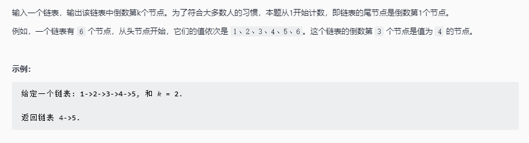

# 链表中倒数第 k 个节点

## 题目链接

[Leetcode 剑指 Offer 22. 链表中倒数第k个节点](https://leetcode-cn.com/problems/lian-biao-zhong-dao-shu-di-kge-jie-dian-lcof/)



## 思路分析

函数签名如下

```java
public ListNode getKthFormEnd(ListNode head, int k)
```
 
 利用双指针，让一个指针 p1 先走 k 步，再让两个指针同时滑动直到指针 p1 到达链表尾部

## 代码实现

```java
class Solution{
    public ListNode getKthFormEnd(ListNode head, int k){
        ListNode p1 = head;
        for(int i = 0;i < k;i++){
            p1 = p1.next;
        }
        ListNode p2 = head;
        while(p1 != null){
            p1 = p1.next;
            p2 = p2.next;
        }
        return p2;
    }
}
```
