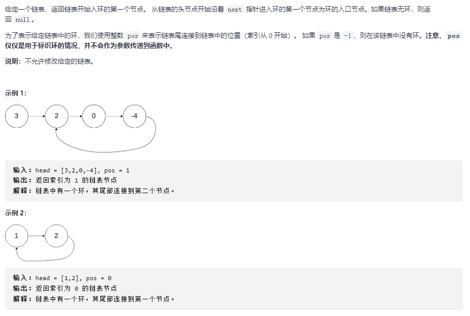

# 链表中环的入口节点

## 题目链接

[LeetCode 剑指 Offer II 022. 链表中环的入口节点](https://leetcode-cn.com/problems/c32eOV/)



## 思路分析

函数签名如下

```java
public ListNode detectCycle(ListNode head)
```

首先看如何判断链表中有环

用快慢指针同时遍历链表，如果快指针最终为空，说明没有无环，如果快指针最终与慢指针相遇，则说明有环

```java
boolean hasCycle(ListNode head){
    ListNode fast = head, low = head;
    while(fast != null && fast.next != null){
        fast = fast.next.next;
        low = low.next;
        if(fast == low){
            return true;
        }
    }
    return false;

}
```

如果快慢指针相遇，一定是在环内。

假设 low 走了 k 步，那么 fast 一定走了 2k 步，多走的 k 步一定是环大小的整数倍

设环起点到相遇点的距离为 m，那么从起点到环起点的距离就为 k-m，且从相遇点走 k-m 步也到达环起点

最终的解法就是当两个指针相遇时，让 fast 从起点开始，low 从相遇点开始，每次走一步，再次相遇时的位置就是环起点

## 代码实现

```java
class Sulotion{
    public ListNode detectCycle(ListNode head){
        ListNode fast = head, low = head;
        while(fast != null && fast.next != null){
            fast = fast.next.next;
            low = low.next;
            if(fast == low){
                fast = head;
                while(fast != low){
                    fast = fast.next;
                    low = low.next;
                }
                return fast;
            }
        }
        return null;
    }
}
```
