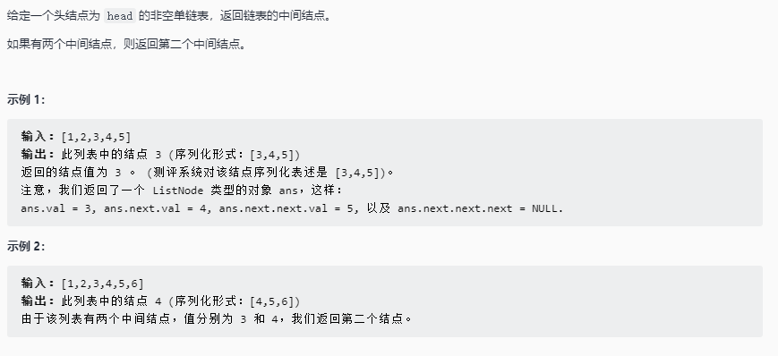

# 链表的中间结点

## 题目链接

[Leetcode 876. 链表的中间结点](https://leetcode-cn.com/problems/middle-of-the-linked-list/)



## 思路分析

函数签名如下

```java
public ListNode middleNode(ListNode head)
```

双指针实现，快指针每次走2步，慢指针走每次走1步，当快指针到达链表尾部时，慢指针所在位置即为链表中间结点

## 代码实现

```java
class Solution {
    public ListNode middleNode(ListNode head){
        ListNode fast = head, low = head;
        while(fast != null && fast.next != null){
            fast = fast.next.next;
            low = low.next;
        }
        return low;
    }

}
```
